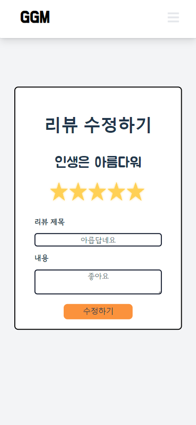

# Final-pjt


### GGM(GGOGGOMovie)

: 꼬리에 꼬리를 무는 영화


### Brief Information

기간 : 2022.05.19~26

개발 언어 : Node 16.X, Vue.js 2.X

팀장: 박종선 - 백앤드

- 백앤드
- ERD 작성
- REST API 설정
- TMDB API에서 영화 데이터 DB에 저장
- 추천 알고리즘 설계 등

팀원: 이동근 - 프론트앤드

- Endpoint 설정
- AJAX 요청 응답
- Vue.js 컴포넌트 구조 설계 및 구현
- CSS, Tailwindcss 스타일링 등

개발환경

- 협업 툴: GitHub
- 개발도구: Visual Studio Code, Chrome
- 개발 언어: Python, Javascript, HTML, CSS

- 프레임워크 & 라이브러리: Vue.js, Tailwindcss, Django, Django REST Framework, SQLite3, dj-rest-framework, django-allauth, Axios, Vuex, Vue router

목표

- 영화 데이터 기반 추천 서비스 구성
- 영화 추천 알고리즘 구성
- 커뮤니티 서비스 구성
- HTML, CSS, JavaScript, Vue.js, Django, REST API, Database 등을 활용한 실제 서비스 설계
- 서비스 관리 및 유지보수


### 프로젝트 과정

#### ERD


#### component 구조
```html
##### App
Navbar
HomeView
SignupView
	AccountErrorList
LoginView
	AccountErrorList
LogoutView
MovieView
	SearchForm
	SearchMovieList
		MovieCard
	MovieList
		MovieCard
DetailView
	GenreLabel
CommunityView
	ReviewList
ProfileView
	MyMovieList
		MovieCard
	MyReviewList
		ReviewList
ReviewDetailView
	CommentList
		CommentForm
		CommentItem
ReviewCreateView
	ReviewForm
ReviewEditView
	ReviewForm
NotFound404
```


**등록되어 있지 않은 파일을 장고에서 사용**

```python
# 시작하기 전에 프로젝트에 등록되어 있지 않은 파일을 장고에서 사용하려면 기본적으로 에러가 발생한다.
# 이것저것 구글링해본 결과 아래 코드를 최상단에 입력해 문제를 해결할 수 있었다.
# 자신의 컴퓨터에 있는 환경변수를 불러와 등록해주는 과정이라고 한다.
import os
os.environ.setdefault("DJANGO_SETTINGS_MODULE","config.settings")

import django
django.setup()
```


**genre data DB에 저장**

```python
# TMDB API - /genre/movie/list에 api_key를 params에 포함하여 요청을 보내어 데이터를 받는다.
        response = requests.get(BASE_URL+PATH, params = params)
	    # response.json()으로 json파일을 읽는다.
        data = response.json()
		# 혹시 빈 데이터일 수 있으니 .get methods를 사용한다.
        genres = data.get("genres")
        for genre in genres:
			# create를 이용하여 생성한다. id는 DB에서 pk로 지정되어있다.
            Genre.objects.create(
                id = genre['id'],
                name = genre['name']
            )
```


**movie data를 DB에 저장**

```python
# 영화 데이터에는 우리가 원하는 DB fields 중에 값이 없는 경우가 존재했다. 이럴 경우 출력할 때 문제가 생길 수 있기 때문에 값이 비어있는 경우에는 아예 DB에 저장하지 않게 예외처리를 했다.
if not movie.get('title', 0) or not movie.get('release_date', 0) or not movie.get('vote_average', 0) or not movie.get('overview', 0) or not movie.get('poster_path', 0) or not movie.get('backdrop_path', 0):
    continue

# JSON 파일을 DB에 저장할 때 ManyToMany 같은 경우에는 별도의 방법으로 구현해야 제대로 DB에 들어갔다.
# 따라서 movie의 genre data의 pk가 들어있는 list에서 하나하나를 뽑아 해당 pk로 직접 검색을 한 후에
# .add()로 하나씩 추가했다.
				for now in movie['genre_ids']:
                    genre = Genre.objects.get(pk=now)
                    now_movie.genre_ids.add(genre)
                now_movie.save()
```


**DB data를 json 파일로 저장**

```python
# 기존에 알았던 python manage.py dumpdata > 파일이름.json 로는 오류가 떴다. 
# 찾아보니 인코딩의 문제인 것 같다. 이를 해결해 주기 위해 아래 코드로 dumpdata를 생성하니 문제가 해결됐다.
python -Xutf8 manage.py dumpdata > 파일이름.json

# 한 가지 문제가 있었는데 이렇게 데이터를 저장한다면 우리가 원하는 데이터 뿐만이 아니라
# 전체 DB가 json 파일로 저장되는 것이기에 DB의 Model과 관련된 데이터도 같이 json파일에 저장된다.
# 따라서 model을 바꾼다면 기존 DB와 충돌이 일어나 제대로 들어가지 않는 상황이 발생했다. 
# 이를 해결하기 위해서는 App 별로 dumpdata를 만드는 방법과 직접 json 파일에서 불필요한 데이터를 지우는 방법이 있었는데
# app이 많아져서 관리하기 어려워 json 파일을 직접 수정하여 우리가 원하는 genre, movie 데이터가 아닌 그 외의 데이터를 지웠더니 잘 들어갔다.
```


**User class에 nickname field 추가 저장**

```python
# nickname이라는 별도의 field를 user에 저장하기 위해서는 CustomerUser를 사용해야했다.
# field를 만드는 것과 DB에 저장하는 것은 별개의 문제였기에 상당히 복잡했다. 해당 게시글을 참고해서 진행했다.
# https://velog.io/@ready2start/DRF-djrestauth로-커스텀-회원가입-구현하기


# accounts/models.py
class User(AbstractUser):
    nickname = models.CharField(max_length=30, unique=True)

# save_user() 내에서 상위 클래스인 DefaultAccountAdapter의 
# save_user() 메서드를 통해 받은 값을 user에 저장. 
# (user = super().save_user(request, user, form, False)) 
# 그런데 이때 유저 정보를 바로 저장하면 안 되므로, commit 인자의 값은 False로. 
# 다음으로 추가 필드의 값들을 저장한 뒤, 유저 정보를 저장.

# accounts/adapters.py
from allauth.account.adapter import DefaultAccountAdapter
class CustomAccountAdapter(DefaultAccountAdapter):
    def save_user(self, request, user, form, commit=True):
        data = form.cleaned_data
        user = super().save_user(request, user, form, False)
        # 추가 저장 필드: nickname
        nickname = data.get("nickname")
        if nickname:
            user.nickname = nickname
        user.save()
        return user

# 그리고 해당 어댑터가 유저 정보를 저장하는 어댑터임을 알리기 위해,
# settings.py에 아래 코드를 추가

# <project_name>/settings.py
ACCOUNT_ADAPTER = 'accounts.adapters.CustomAccountAdapter'

# serializer도 다시 설정해줘야 했다.
# RegisterSerializer에서 상속받아 CustomRegisterSerializer를 만들어서 진행한다.
# 부모 클래스의 get_cleaned_data를 이어받아 super().get_cleaned_data()로 불러온다.
class CustomRegisterSerializer(RegisterSerializer):
    # 추가 설정 필드: nickname
    nickname = serializers.CharField(max_length=30)

    def get_cleaned_data(self):
        data = super().get_cleaned_data()
        data['nickname'] = self.validated_data.get('nickname', '')
        return data

```


**장르별 영화 랜덤 추천 알고리즘**

```python
# 장르가 주어지면 장르별로 랜덤으로 영화를 24개 출력하려했다. 하지만 랜덤으로 출력할려면 어떻게 해야할지 감이 안잡혔었다. 하지만 검색해보니 랜덤으로 정렬하고 거기서 원하는 개수를 뽑으면 해결할 수 있었다.
# .order_by('?') 를 사용하면 랜덤으로 정렬되어 24개를 뽑았을 때 랜덤으로 출력할 수 있었다.
movies = Movie.objects.filter(genre_ids=genre_id).order_by('?')[:24]
```


**Content based filtering 기반 영화 추천 알고리즘**


```python
# 리뷰를 작성할 때 평점을 3점 이상으로 평가한 경우 : '선호'한다고 표현
# 자신이 '선호'한 영화들을 마찬가지로 '선호'한 유저들이 '선호'한 다른 영화들의 목록을 받아
# 내가 리뷰를 단 영화와 내 영화(추가 기능으로 구현함) 리스트에서 중복되지 않게 제외한 후, : '중복 제거'라고 표현
# 해당 영화들의 기존 정보인 vote_average와
# 우리가 만든 플랫폼에서 유저들이 부여한 평점의 평균 정보를 7:3 비율로 반영하여
# 독자적인 새로운 평가 점수를 만들었다.
# 해당 평가 정보를 기준으로 정렬하여 24가지를 출력하는 추천 알고리즘을 만들었다.
# 작성한 리뷰 숫자가 적어 24가지를 채우지 못한 경우에는
# 자신이 '선호'하는 영화의 장르를 랜덤으로 뽑아
# 해당 장르의 영화에서 '중복 제거'한 후 vote_average를 기준으로 채워주었다.
# 아예 하나도 리뷰를 달지 않은 유저의 경우에는 전체 장르에서 랜덤으로 뽑아 vote_average를 기준으로 추천하였다. 

# 자신이 평점을 3점 이상으로 부여한 리뷰 리스트를 불러온다.
# __gte는 greater than equal의 의미로 해당 값보다 더 큰 값으로 filter할 수 있다.
reviews = user.reviews.filter(rate__gte=3)

# 해당 유저가 리뷰를 단 영화 & 내 영화 리스트에 추가한 영화 제거 & 24개로 제한 
    user = request.user
    reviews = user.reviews.all()
    my_movies = user.my_movies.all()

		# ~Q(pk__in=my_movies) 는 Q를 부정한다는 의미로 여기서는 pk가 내 영화들 목록에 없는 것들만 filtering하는 것을 의미한다.
		# 여러가지 조건으로 연결할 때는 &을 사용하여 연결한다.
    recommended_movies = recommended_movies.filter(~Q(pk__in=my_movies) & ~Q(reviews__in=reviews))[:24]

# 우리가 원하는 것은 Movie에 연결된 Review의 rate를 가지고 평균을 내는 것이였다.
# 바로 참조가 불가능 했기에 많은 어려움이 있었는데 Field Lookup이라는 기능이 있었다.
# Field Lookup Django
# 공식문서 참고 : https://docs.djangoproject.com/en/4.0/ref/models/querysets/#field-lookups-1
# Movie.objects.filter('어떤 조건').annotate(rate_average=Avg('reviews__rate'))

# 영화 Model에서 기존에 설정한 related_name인 reviews로 review들을 가져오고
# 거기서 __rate를 통해 다시 rate를 가져올 수 있었다.
# 그것에 .annotate와 Avg를 사용하여 영화에 해당 영화의 리뷰들에서의 평점들을
# 평균한 정보를 rate_average라는 이름으로 참조할 수 있게 됐다.
recommended_movies = list(recommended_movies.annotate(rate_average=Avg('reviews__rate')))

# 여기서 영화의 기존 정보인 vote_average와 우리가 만든 rate_average 정보를 활용하여 
# 7 : 3 비율로 반영하여 새로운 점수를 만들어 해당 점수를 기준으로 추천 목록을 정렬하는 알고리즘을 만들었다.
# (vote_average는 0~10이기에 2로 나누어 반영, rate_average는 0~5)
recommended_movies.sort(key=lambda x : -(0.3*x.vote_average/2 + 0.7*x.rate_average))
```


**List 를 QuerySet으로 변경**

```python
# 작업할 때에 기존의 list로 작업하려고 하니깐 queryset에서만 사용 가능한 동작들이 많아서 도저히 진행할 수 없었다. 따라서 list를 queryset으로 변경하는 방법이 있을 것 같아서 찾아보니 존재했다. queryset을 list로 변경하는 것은 쉬우나 되돌리기는 약간의 과정이 필요했다.
    def list_to_queryset(model, data):
        from django.db.models.base import ModelBase
        if not isinstance(model, ModelBase):
            raise ValueError(
                "%s must be Model" % model
            )
        if not isinstance(data, list):
            raise ValueError(
                "%s must be List Object" % data
            )
        pk_list = [obj.pk for obj in data]
        return model.objects.filter(pk__in=pk_list)

    recommended_movies = list_to_queryset(Movie, recommended_movies)
```


**메인 페이지 Owl Carousel**


```html
<!-- 여러가지 영화 정보를 출력해야하는 상황이므로
넷플릭스와 비슷한 carousel이 깔끔하다고 판단했다.
하지만 구현이 힘들어서 끝까지 미뤘었는데
마지막으로 시간이 남아서 여유롭게 찾아보는 중 Owl Carousel이란 용어로
이미 관련 기능이 라이브러리로 배포가 되고 있었다. --> 
<!-- 설치 방법 -->
npm i -s vue-owl-carousel

<!-- 사용 방법 -->
import carousel from 'vue-owl-carousel'

export default {
    components: { carousel },
}

<!-- 사용 예시다 -->
<carousel>
    
    
    
    
</carousel>
```


**리뷰 데이터에 평점 반영**



```html
<!-- 평점을 별로 매기는 것도 라이브러리가 존재하여 사용했다. -->
<!-- 설치 방법 -->
npm install vue-star-rating

<!-- components 등록 -->
import StarRating from 'vue-star-rating

components: {
  StarRating
}

<!-- v-model로 data와 연결 -->
<star-rating v-model="rating"></star-rating>

<!-- style props 설정 -->
<!-- ex) 별 3개 0.5점씩 90사이즈 -->
<star-rating v-bind:increment="0.5"
             v-bind:max-rating="3"
             inactive-color="#000"
             active-color="#f00"
             v-bind:star-size="90">
</star-rating>
```


### 느낀점

- 사이드 프로젝트도 별도로 이전에 진행 했었지만 사람이 적어서 그런지 더 책임감이 부여됐고 그에따라 자연스레 더 애정도 있었다. 프론트를 맡은 팀원도 구현 욕심이 많아서 구현하고자 하는 부분에서 의견이 잘 맞아서 좋았다.

+ 프론트와 백으로 제대로 역할을 지정해서 분업하니 확실히 편했다.
  + 서로 상대방의 상대방이 담당한 영역도 전반적으로 알고 있었기에 필요시엔 본인이 직접 수정할 수도 있었지만 불가피한 경우가 아니라면 장기적인 역할 분담에 익숙해지기 위해 특히 초반엔 가급적 지양하려고 했다.

- 프로젝트 진행 순서에 조금 더 의견을 적극적으로 반영할 수 있어서 좋았다. 애자일 방법론을 지향하려고 노력했다. 
  - 가장 먼저 REST API를 짜서 front와 back이 어떤 url로 데이터를 보내주고 받아와야 하는지에 대한 약속을 정했다.
  - 그 이후 해당 요청으로 주고받는 데이터가 잘 들어가는지 확인하는 작업을 진행했다. 꾸미는 것은 후순위고 기능 자체가 동작하는지 아닌지 확인하는게 먼저라고 생각되어서 이렇게 진행하였다.
    - 백앤드에서 함수를 작업하면 바로바로 데이터를 얻어서 프론트단에서 html에 데이터 전부를 볼 수 있게 바로 뿌려주는 작업을 동시에 진행했다.
    - 물론 그 와중에도 프론트를 맡은 팀원은 엄청난 작업량으로 컴포넌트들의 구조 관계를 정립하고, 동작들도 주요 기능들은 대부분 이미 다 끝낸 상황이였다.
  - 물론 이런 방식으로는 프론트앤드의 작업이 전체적으로 뒤로 미뤄지는 문제점이 있었지만 개별 기능들이 동작하는게 가장 먼저라고 판단했다. 보여주는 것은 어떻게든 보여주면 되는 것이기에. 이렇게 백앤드 부분이 먼저 끝나게 됐고 이에 따라 프론트 단의 일부 스타일링을 돕는 방식으로 진행됐다.
  - 이후 어느 정도 마무리가 된 이후에 더 욕심나는 기능들을 추가적으로 구현했다. 이런 방식으로 진행하다보니 마감에 쫒기듯 필수 기능들을 구현하는 상황을 방지할 수 있었고 여유롭게 진행할 수 있었다.

- 당장 서비스를 맨 처음부터 하나 만들자면 프론트앤드 쪽에서 해야하는 부분들이 백앤드에 비해서 너무 많다는 것을 더욱 느꼈다. 

- 계속해서 github으로 작업하다보니 git 사용에 많이 익숙해졌다.
