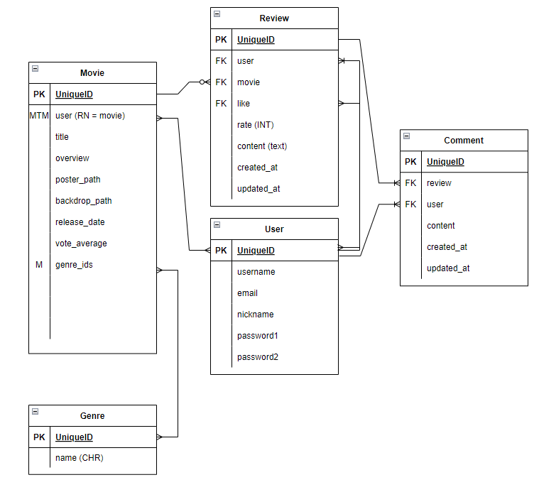
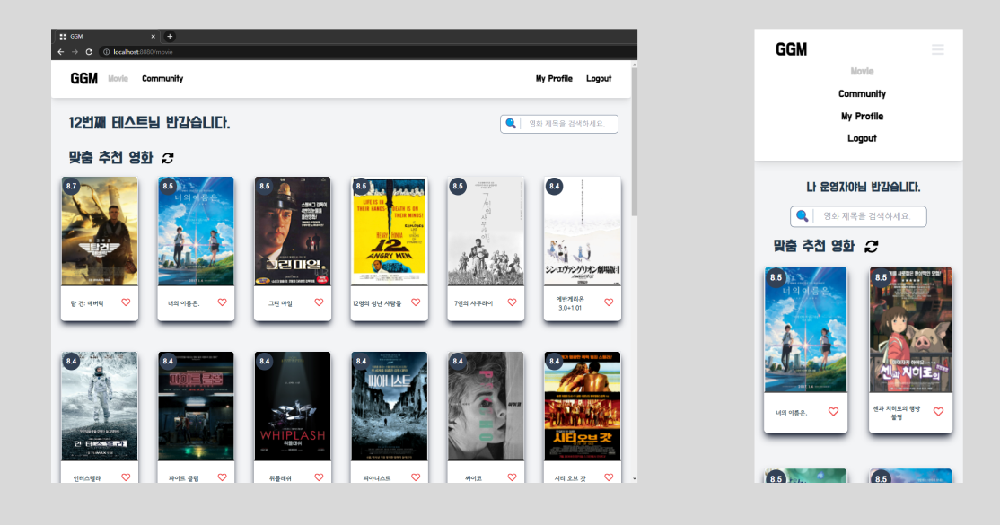
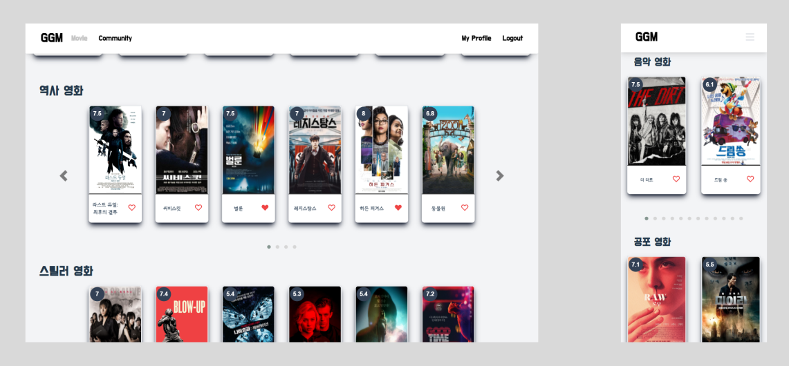
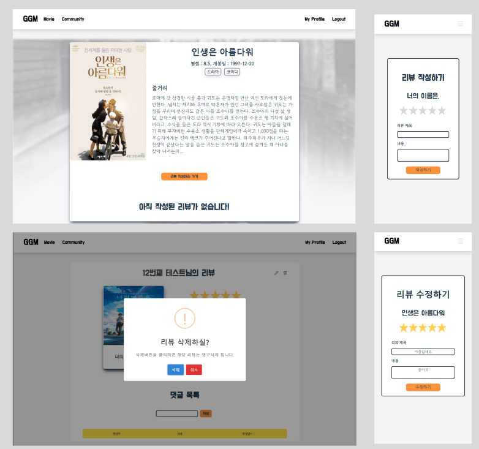
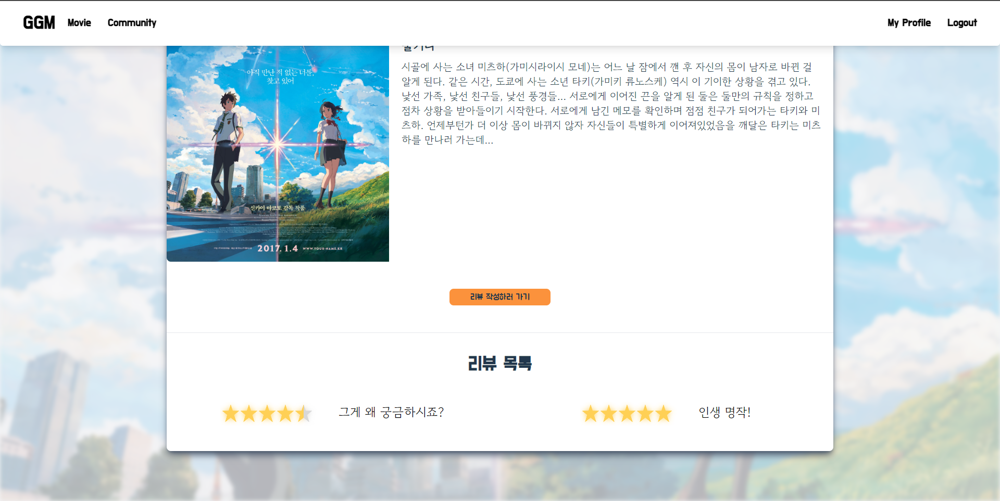
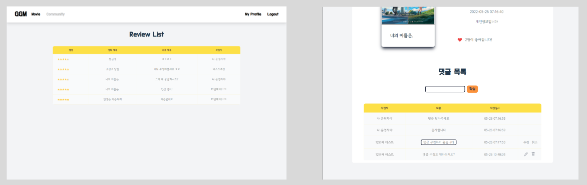
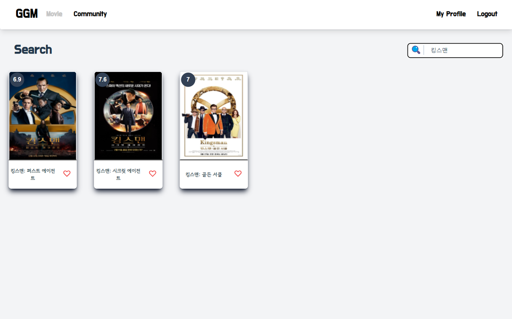
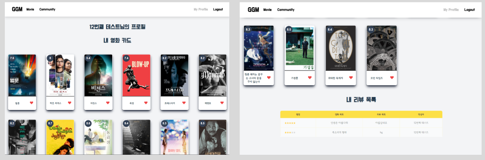
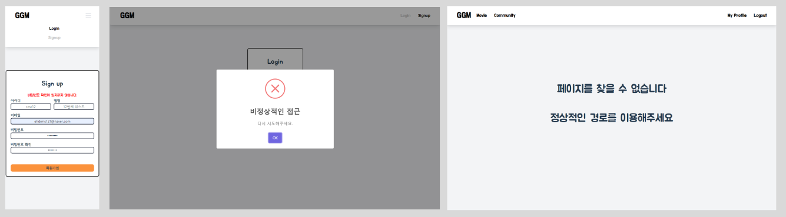

# 관통 프로젝트

## **GGOGGOMovie** (꼬꼬무)

> 꼬리에 꼬리를 무는 영화 추천

**Django REST API + Vue.js 활용 반응형 웹** 

진행 기간 : 22.05.19 ~ 22.05.26

**팀장  : 박종선 (Back-end)**

- 데이터베이스 관리
- 추천 알고리즘 설계
- REST API

**팀원 : 이동근 (Front-end)**

- AJAX 통신
- Vue 상태 관리

- CSS 스타일링

## 1. 목표

- 영화 데이터 기반 추천 서비스 구성
- 영화 추천 알고리즘 구성
- 커뮤니티 서비스 구성
- 다양한 언어와 프레임워크 및 라이브러리 활용 실제 서비스 설계
- 서비스 관리 및 유지보수

## 2. 기술 스택

**Tools**

- VS code
- Chrome

**Back-end**

- Django wtih Django REST framework
- SQLite3

**Front-end**

- Vue.js
- Tailwind CSS

## 3. 설계

### 개발환경 설정

- django
- django-rest-framework

- Vue cli
- Vuex
- Vue-router
- Tailwind CSS

### ERD

### Component 구조

#### [APP]

Navbar

HomeView

SignupView

- AccountErrorList

LoginView

- AccountErrorList

LogoutView

MovieView

- SearchForm
- SearchMovieList
  - MovieCard
- MovieList
  - MovieCard

DetailView

- GenreLabel

CommunityView

- ReviewList

ProfileView

- MyMovieList
  - MovieCard
- MyReviewList
  - ReviewList

ReviewDetailView

- CommentList
  - CommentForm
  - CommentItem

ReviewCreateView

- ReviewForm

ReviewEditView

- ReviewForm

NotFound404

### 영화 정보 데이터베이스

포스터와 백드롭 이미지 정보가 있는 한국영화 DB 저장

## 4. 구현

### 1. 추천 페이지

추천 알고리즘을 이용하여 유저에게 맞춤 영화 12개를 추천합니다. 새로고침을 통해 다른 영화 추천을 요청할 수도 있습니다.

추천 영화 아래에는 랜덤한 3개의 장르에서 24개의 영화를 소개해줍니다.

양 쪽의 <> 버튼을 클릭하여 한 장씩 넘겨볼 수 있으며, 가운데 . 을 클릭하면 반응형에 의해 나타나는 카드의 개수만큼 한 페이지씩 넘길 수 있습니다.

각 카드 이미지는 해당 영화의 디테일 페이지로 이동할 수 있게 해줍니다.

하트를 누르면 내 영화에 등록할 수 있습니다.

### 2. 영화 평점

영화에 대한 평점을 0점부터 5점까지 0.5점 단위로 입력할 수 있고 사용자 경험을 위해 star-rating을 활용했습니다.

작성된 리뷰에서 포스터를 클릭 시 해당 영화 상세 페이지로 이동합니다.

작성한 리뷰는 작성자만 수정/삭제할 수 있습니다. 수정 시 기존값을 가져와 입력창에 넣어줍니다.

삭제 시에는 경고 메시지를 띄워 한 번 더 확인합니다.

각 영화 상세정보에는 해당 영화의 유저들의 평점을 포함하고 있습니다.

### 3. 커뮤니티

커뮤니티 페이지에서 작성된 리뷰 목록을 볼 수 있습니다.

리뷰 디테일 페이지에서는 댓글을 달 수 있으며, 댓글 작성자만 수정/삭제가 가능합니다.

수정시에는 사용자 경험을 위해 해당 위치에서 수정할 수 있습니다.

리뷰와 마찬가지로 삭제 시에는 확인 메시지를 보여줍니다.

리뷰 상세페이지에서 리뷰와 댓글에 생성일시&최종수정일시가 표기됩니다.

### 4. 검색 기능

영화 추천 페이지에서 우측 상단의 입력창을 이용하여 DB에 저장된 영화를 검색할 수 있습니다.

사용자 경험을 위해 검색어를 삭제할 시 검색 전의 기존 영화들을 보여줍니다.

### 5. 영화 좋아요 기능

추천 페이지에서 하트를 눌러 내 영화에 추가할 경우 프로필에서 해당 영화들을 살펴볼 수 있습니다.

마찬가지로 내가 작성한 리뷰 목록도 볼 수 있습니다.

카드를 클릭하면 영화 상세페이지, 리뷰를 클릭하면 리뷰 상세 페이지로 이동합니다. 

### 5. Error Handling

회원가입 또는 로그인 시 잘못된 정보 요청 시 해당 오류 메시지를 출력하게 했습니다.

로그인 되지 않은 사용자가 회원만 접근 가능한 페이지 접근 시 정상적인 접근을 권하는 메시지를 띄웠습니다.

지정하지 않은(개발자가 의도하지 않은) 주소로 접근 시도 시 알림페이지를 반환하였습니다.

### 느낀점

- 함께하는 팀원과 팀을 이루고 역할을 나눠 오롯이 프론트 엔드 개발자로서 작업을 진행하는 좋은 경험을 했습니다.
- 본격적인 개발에 앞서 기획단계에서 REST API 설계를 잘 해 둔 덕분에 팀원과 서로 얼굴 붉히는 일 없이 데이터를 잘 주고 받을 수 있었습니다. 어떤 요청을 보내고 어떤 응답을 받을지, 데이터베이스 관리는 어떻게 할 지, 상태 관리는 어떻게 할 지 등과 같은 내용들을 팀원과 소통하면서 프로젝트를 설계하며 의사소통이 굉장히 중요하다는 것을 깨달았습니다. 
- 모르는 것이 생겨도 스스로 찾아보면서 해결하려 노력하였습니다. 이런 규모의 프로젝트는 처음이라 진행하면서 많은 어려움을 겪었지만 그것을 해결하는 과정에서  성장하는 것을 느꼈습니다.
- 일주일이라는 기간동안 제가 얼만큼의 작업을 소화할 수 있는지 전혀 모르고 있었기때문에 다양한 기능들을 넣어보자하며  많은 욕심을 부렸던 것이 아쉽습니다. 이번에 tailwindcss를 이용하여 css 작업을 했는데, 익숙하지 않은 프레임 워크라 적응하는데 오랜 시간이 걸렸습니다. 그래서 부가적인 기능은 뒤로 미루고 프로젝트의 중심이 되는 부분들을 잘 동작하도록 노력했습니다.
- 사용자 입장에서 동선을 생각해보고, 그것을 기준으로 컴포넌트의 구조를 설계하며 나름 즐거움을 느꼈습니다. 하지만 역시 프로젝트를 진행하다보니 생각지 못한 부분에서 동작이 잘 안되기도 하며 애를 먹었고, 나중에는 해결하기에 급급해서 스타일 가이드에 맞게 코드를 작성하지 못한 경우도 발생했습니다. 욕심을 부리지 말고 침착하게 데이터를 관리해야겠다고 생각하고 다시 페이지 별로 어떤 데이터들이 필요한지, 그것을 어떻게 가져올 것인지 등을 고민하였고, 이후에는 큰 어려움 없이 데이터 전달을 해낼 수 있었습니다.
- UX 개선을 위해 더 시간을 쓰고 싶지만 프로젝트 기간이 짧아 생각했던 기능들을 전부 마무리하지 못해 아쉬움이 많이 남습니다. 제 생각보다 컸던 규모의 프로젝트였고, 주어진 시간동안 제가 생각한 모든 기능들을 담기에는 제 능력이 부족하다는 생각은 못해 많이 힘들었던 것 같습니다. 그래도 이번 프로젝트를 계기로 사용자 입장에서 생각해보는 법도 배웠고, 어떤 점들을 개선해나가야 더 좋은  서비스를 제공할 수 있을 지 조금이나마 알 수 있었다고 생각합니다.

